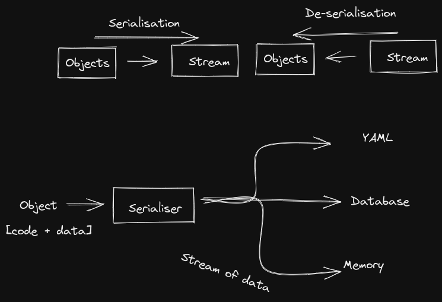

YAML initially stood for Yet Another Markup Language.
YAML now stands for YAML Ain't Markup Language.

###### What is Markup Language?
- A markup language specifies the structure.

# YAML

- YAML is basically a data format used to exchange data.
- Similar to XML and JSON.
- It can only store data and not commands.
- Storing of data in files is known as Data Serialisation.

#### Data Serialisation

This helps in transfer of objects in different platform or machine learning models.

It is the process of converting the data objects into a stream of storage.

Data Serialisation languages: YAML, JSON, XML

A markup languages store only documents, but in YAML
both documents and objects can be stored.

YAML is generally used in Kubernetes Configuration files.

##### Benefits:

- simple & easy to read (parsing)
- a strict syntax (indentation is important).
- easier than JSON & XML
- more powerful when it represents complex data
- use various tools (to automate YAML files)

YAML files use .yml or .yaml extensions

- key -> values
- yaml is case sensitive
- indentation is done only using spaces
- `---` is used separate different datatypes.
- `...`is used to end documents
- `#` is used for comments