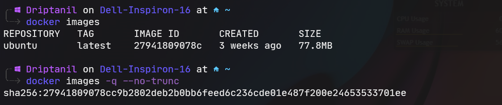

### Containers

- Containers provide a way of creating an isolated environment, sometimes called a sandbox, in which applications and their dependencies can live.

#### Why are containers useful?

- **Portability** – the isolated environment that containers provide effectively means the container is decoupled from the environment in which they run. They don’t care much about the environment in which they run, which means they can be run in many different environments with different operating systems and hardware platforms.

- **Consistency** – since the containers are decoupled from the environment in which they run, you can be sure that they operate the same, regardless of where they are deployed. The isolated environment that they provide is the same across different deployment environments.

- **Speed to deploy** – for the same reasons as above. There is no need for considerations around how the application will operate in a production environment. If it runs in a container in one environment (say, your local machine), then it can be made to run in a container in another environment (say, in a cloud provider) very quickly

#### What is it made of?

- It has a layer of images:
  
	1. Linux Base Images, which is small in size (Alpine Linux)
	   _(at the bottom)_
	   
	2. Intermediate Images
	   _(at the middle)_
	   
	3. Application Images
	   _(at the top)_

# Docker 
- Docker is an open platform for developing, shipping, and running applications. 
- Docker provides the ability to package and run an application in a loosely isolated environment called a container. 
- It eliminates the need to install the dependencies and required packages for development.

Docker _(list of instructions)_ -> Image _(class)_ -> Container _(object)_

###### before containers:
- development team would send configuration files and instructions to the operations team.
- operations team would configure the server to host an application.
- often lead to miscommunication, and conflicts and cause delay.

###### after containers :
- No environment configuration is needed on the server, which is a one-time effort.
- Maintains harmony between the development and operations team.

#### Container & Image

**Image**:
- Images are the actual packages

**Container:**
- When the image is pulled and started, that is a container.
- It is a running environment for an image.
  
## Docker vs Virtual Machine

##### Docker:
- Docker only has its own Application Layer (1 layer)
- faster
- size: MB
  
  
##### Virtual Machine
- Virtual Machine has its own Application Layer and OS kernel
- slower
- size: GB
  
### Docker Runtime
- Runtime allows us to start or stop the containers.
- #### Run C
	- `runc` is used to start or stop the containers.
- #### Container D
	- `container d` is used to manage `runc` and also control how the container would interact with the internet.
- #### Shim 
	- Once the container is created, `runc` will be removed, and for instance, docker daemon is updated. Every container runs on the docker daemon, therefore all running containers will get stopped.
	- `shim` prevents this from happening, it is responsible for the running of containers.

### **Open Container Initiative (OCI)?**

- The **Open Container Initiative** (**OCI**) is a Linux Foundation project to design open standards for containers.
  
- Established in June 2015 by Docker and other leaders in the container industry.
  
- OCI currently contains two specifications: the Runtime Specification (runtime-spec) and the Image Specification (image-spec).
  
- OCI runtime spec defines how to run the OCI image bundle as a container.
  
- OCI image spec defines how to create an OCI Image, which includes an [image manifest](https://github.com/opencontainers/image-spec/blob/master/manifest.md), a [filesystem (layer) serialization](https://github.com/opencontainers/image-spec/blob/master/layer.md), and an [image configuration](https://github.com/opencontainers/image-spec/blob/master/config.md).

## Commands

- `docker run <image>` will run the image and creates a new container, if the image given, is not present locally. Then it will download the docker image from the docker-hub registry.

  
- A docker image contains the operating system files and also the dependencies of the application file.
  
- `docker run -it <image>` will run the image in an interactive environment.
  
 
- `docker images` displays all the images present locally.
  

- `docker pull <image>` will download the image from the docker-hub registry.
  

- `ps aux` displays the processes in the system.
  
  
- `docker container ls` will list all the containers.
  
  
- `docker container exec -it <container_id> bash` will attach the terminal to a running container with a given id.
  
  
- `docker stop <container_id>` will stop a running container with given id.
  
  
- `docker rm <container_id>` will remove the container with the given id.
  
  
- `docker logs <contianer_id>` will display all the history of commands and their outputs.
  
  
- `docker container prune -f` will delete all the stopped containers.
  

- `docker run -d <image>` will run the image in background (detached mode).
  
  
- `docker ps` will display all the running containers. 
  

- `docker ps -a` will display both running and stopped containers.
  

- `docker logs --since <time> <container_id>`
   
  
- `docker stop <container_id>` will stop a running container.
  
  
- `docker run -p <port> <image>` will run the docker image in container on custom port.

  
  
- `docker start <container_id>` will start a stopped container.
  
- `docker commit -m <commit_message> <container_id> <custom_container_name>:<version>` will save the container and display it in `docker images`.
   
  
- `docker images -q` will only display all the container IDs of images.
  

- `docker rmi <docker_image_id> -f` will force remove the docker image.
  
  
- `docker rmi $(docker images -q) -f` will force remove all the docker images.
  -f.png)
  
- Docker images are made of layers.
	- For instance, image 1 uses some common files used by image 2. So downloading the same files twice doesn't make sense. This is why images are divided into layers.
	- Therefore, if image 1 and image 2 have a common layer, then this layer is not downloaded twice.

- `docker images -q --no-trunc` will display the hash value of all the docker images.
  

- `docker inspect <container_id>` displays information about the image in JSON format.
  
  
``` 
╰─λ sudo docker pull ubuntu  

	Using default tag: latest  
	latest: Pulling from library/ubuntu  
	125a6e411906: Already exists
```
-> layer already exists

- `docker login` for login in command line interface.

  
### Docker Config Files


- `docker build -t <custom_image_name> <directory>` to build a image from the docker config files.


- `docker run <images>` will run the docker image.


### Docker Architecture
- Docker uses a client-server architecture.


### Docker Daemon
- Docker daemon `dockerd` listens for requests of Docker API requests and manages Docker objects like images, containers, networks and volumes.
  
### Docker Client
- Docker client `docker` is the primary way that many many Docker users interact with Docker.
  
### Docker Registry
- Docker registry stores Docker images. Docker Hub is a public registry 
