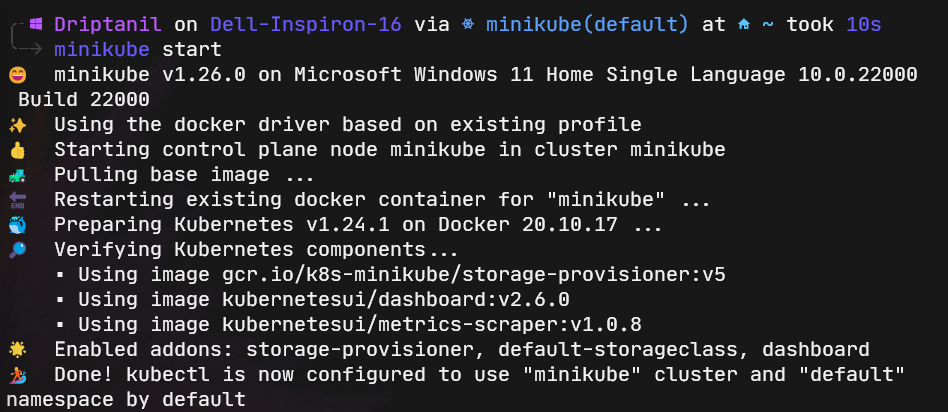
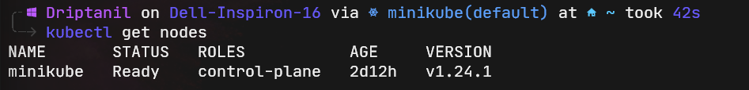
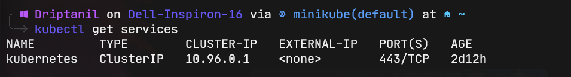

### Pod
- the smallest unit of Kubernetes is a pod
- abstraction over a container
- pod is running environment or a layer on top of the container
- Kubernetes replace the container runtime or container technologies, so that there is no need to directly work with docker
- a single pod can run multiple application (not recommended), but usually one application in one pod
- each pod is assigned with an IP address, so that pods can communicate with each other using the internal IP address
- pods die very easily, a new IP address in assigned to the pod.

### Service
- Service is a static IP address, that is attached to each pod.
- lifecycle of service and pod are not connected,
  i.e. even if the pod dies the IP address will not change.

### Ingress
- before ingress: `http://<ip_address>:port`
- after ingress: `http://application.com`

### Config Map
To change the URL,
	1. rebuild container
	2. push it to repo
	3. pull it to pod

- it is external configuration of your application
- eg. `URL='<name>'` 
- but storing username and password in config map is in-secure.

### Secret
- It is like a config map, but it is used to user credentials.
- it is base64 encoded

### Volumes
if the database container dies, then it losses all its data.
!! Kubernetes doesn't manage data persistence !!

- volumes attaches a physical storage(local / cloud) to pod.

## Blueprint
if the application node dies, then users will face downtime (site cannot be reached).

- creating a replica or clone of node would prevent this issue.
- all node should be connected to the service.
- Service assigns a permanent IP address, and also works as a load balancer (it catches the request and forwards it to the least busy node).
- to create replicas, blueprint: DEPLOYMENT is used
- Blueprint is an abstraction of pods.

if the database node dies, users will face issues

- DEPLOYMENT cannot create replicas of database node.
- to create replicas of database node, all the nodes has to be synced and has to access the same shared data storage. To avoid inconsistency
- blueprint: StatefulSet is used 

## Worker Node

- Each node has multiple pods on it 

### Kubelet 
- It interacts with both container runtime and node.
- starting a pod and assigning resources

Kubernetes cluster is made of multiple nodes (replicas of one node).

### Kubeproxy
- responsible for forwarding requests from services to pods is actually present in same node.  

## Master Node

#### API Service
- is a cluster gateway (entry point).
- acts as a gatekeeper for authentication
- receive request -> validates request -> forwards to other processes

#### Scheduler
- after validation of request by the API server
- request is received by Scheduler 
- intelligently schedules pods to a node according to resources required
- then request is forwarded to Kubelet for execution

#### Controller Manager
- when pods die, the controller manager detects state changes (like crashing of pods) and tries to recover the cluster state
- so it requests the Scheduler to re-schedule the dead pods

### Etcd
- is the cluster brain.
- it stores the cluster changes in a key value store of etcd.
- it stores information like cluster health, resource availability and cluster state changes.
- application data is not stored in etcd

## Master node vs Worker Node
- master node need less resources than worker node.

## Minikube
- is a single node k8s cluster which can be run on virtual box in local machine.

## Kubectl
- allows the user to interact with k8s cluster.
- it is a command line tool, which talks to the API server.

# Commands
- `minikube start` will start Minikube(single node k8s cluster).
  
  
- `kubectl get nodes` will display all the pods
  
  
- `kubectl get services` will display all the services
  
  
- `kubectl create deployment <name> --image=<image>` will create a deployment pod.
  ![][images/kubectlcreatedeploymentname--image=image.png]
  
- `kubectl get deployment` will display all the deployments
  ![][images/kubectlgetdeployment.png]
  
  In lens, 
  ![][images/lensnginxdeployment.png]
  
- `kubectl get pods` will display all the pods
  ![][images/kubectlgetpods.png]
  
  In lens,
  ![][images/lensnginxpod.png]
  
  
- Layers of Abstraction:
	- Deployment -> ReplicaSet -> Pod -> Container

- `kubctl edit deployment nginx-depl` to make changes in the deployment 
  
  or 
  
  in lens,
  ![][images/lensedit.png]